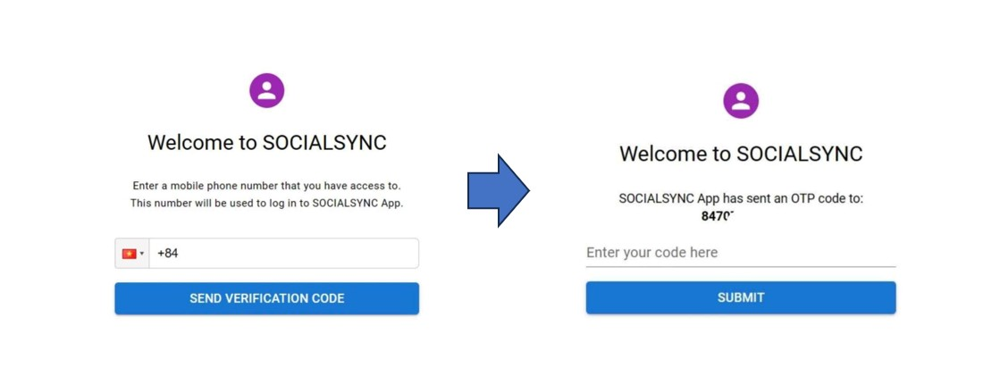
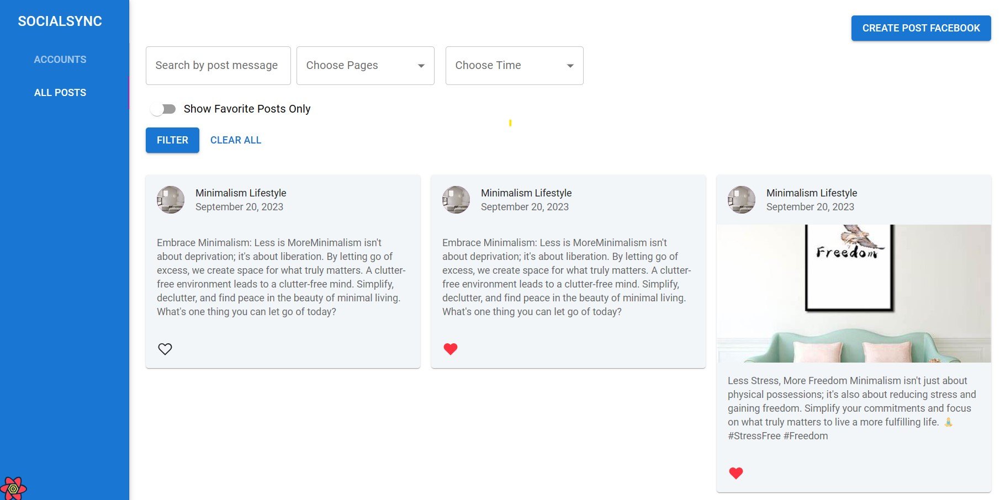
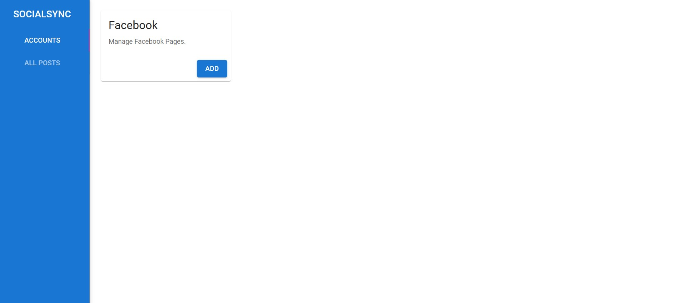
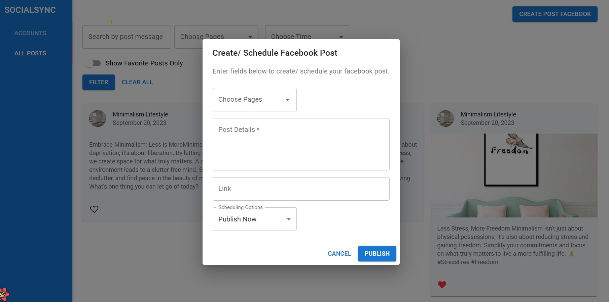
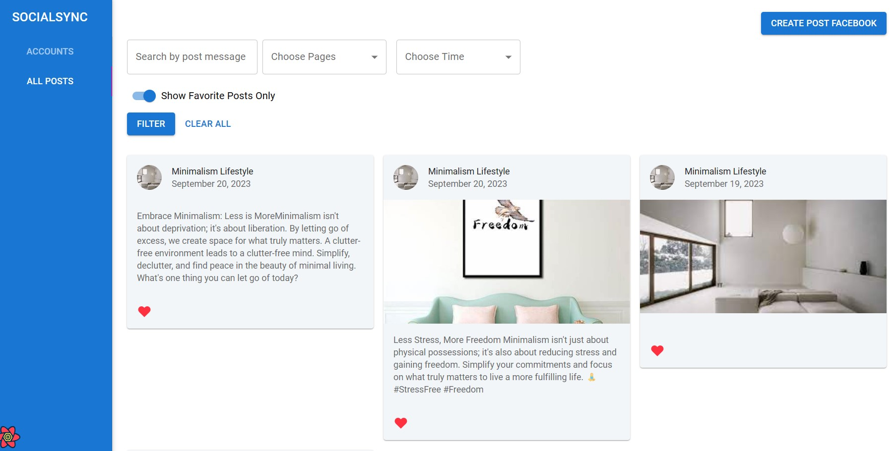
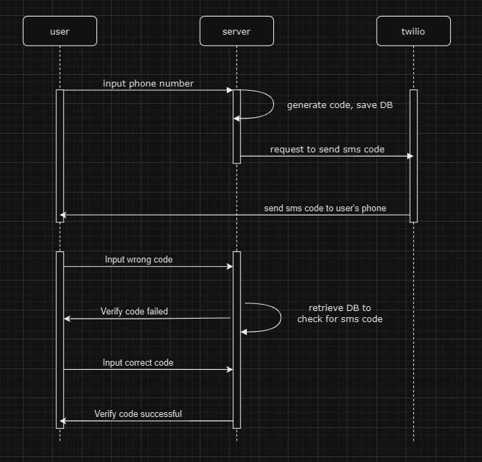
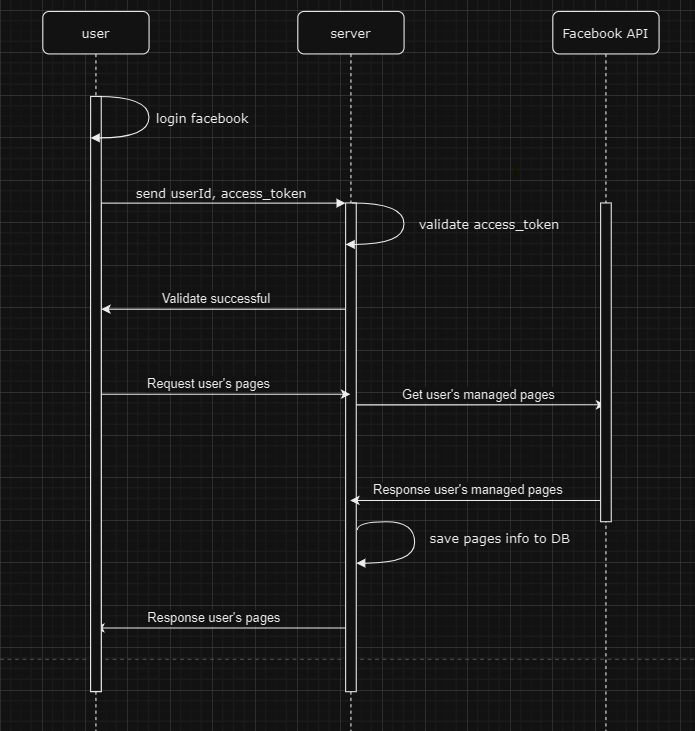
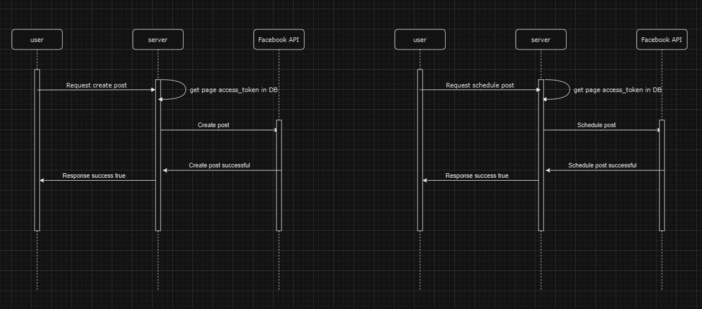
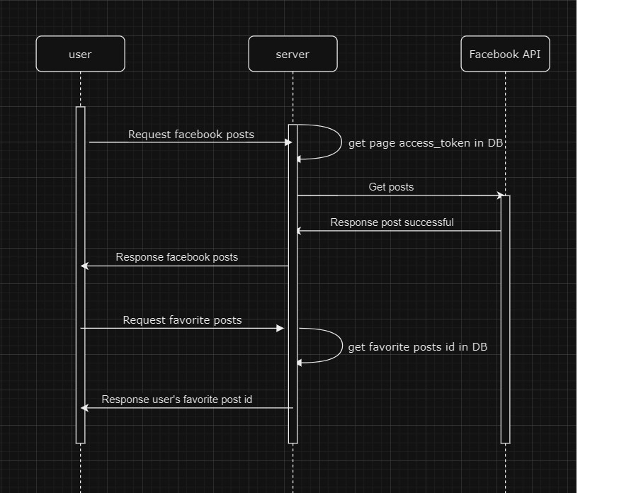
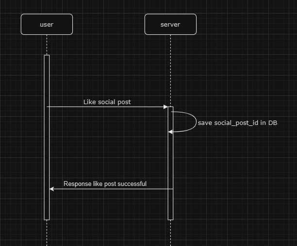

 

  <h1 align="center">ReactJS Coding Challenge</h1>

## Built with
- Frontend: React, MaterialUI, React-query, Typescript
- Backend: ExpressJS, Firebase, Twillio

## Setup

1. Create an `.env` file in the root of the project based on `.env.example` in both client and server
2. `cd server` : `yarn && yarn start`
3. `cd client` : `yarn && yarn dev`

## Project Demo

## Screenshots

#### Login Page

#### All posts

#### Accounts

#### Create/Schedule Post modal

#### Favorite Post

## Link to Facebook pages
- Learning Korean: https://www.facebook.com/profile.php?id=61551126458478
- Minimalism Lifestyle : https://www.facebook.com/profile.php?id=61551628100656

## Unfinished features
For me, this coding challenge was quite large, and exciting at the same time. Unfortunately, I could not finish some functions and features within 5-day timeframe, the list is below: 
- Twitter and Instagram functionalities: 
  
   - I tried my best to complete the flow for managing multiple Facebook pages first, and unfortunately, I did not have sufficient time to integrate Instagram and Twitter functionalities. Given more time, I believe I could do it.

- SMS Code with Twillio: I have successful integrate Twillio into my app, and it said SMS send successful but I did not recieve any in my phone. The issue maybe because of the trial account, so to keep the project going, I decided to focus on the workflow first, and retrieve the access code from the Firebase database to proceed to the next steps.
- The like/heart icon on the selected social post must be lighted up even after the page is refreshed: Since I was working on localhost, the Facebook login SDK did not allow for the persistence of user login. My solution for this is that on page refresh, I can call the server to retrieve the necessary data and render it.

## Projects diagram
#### /CreateNewAccessCode & /ValidateAccessCode

#### /loginFacebook

#### /createPostFacebook & /createScheduledPostFacebook

#### /getPostFacebook & getFavoriterPosts

#### /likeSocialPost

